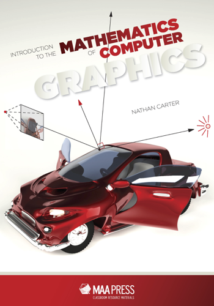

<a href="http://bookstore.ams.org/clrm-51" target="_blank">You can buy the ebook online.</a>

# Welcome

This website is for the textbook _Introduction to the Mathematics of
Computer Graphics_, published by the Mathematical Association
of America.

It has links and resources for readers, both students and
instructors.  I aim for it to evolve and improve for the foreseeable future.
See content links to the left.

 

# News

The textbook has won the 2021 Beckenback Book Prize!  Thanks to the MAA and
all who contributed to the text.
[See full details and acknowledgements here.](https://www.jointmathematicsmeetings.org/meetings/national/jmm2021/prizebooklet-2021-FINAL-12-11-2020.pdf)

 

# Online exercises

Dozens of exercises related to the text exist in the WeBWorK Open Problem
Library.  You can read about the library [here](https://webwork.maa.org/wiki/Open_Problem_Library),
but to be able to browse it, you'll need a WeBWorK installation, as documented
on that page.  The source code for the mathematics of computer graphics
exercises can be found [here](https://github.com/openwebwork/webwork-open-problem-library/tree/master/OpenProblemLibrary/BentleyUniversity/MathematicsOfComputerGraphics).

