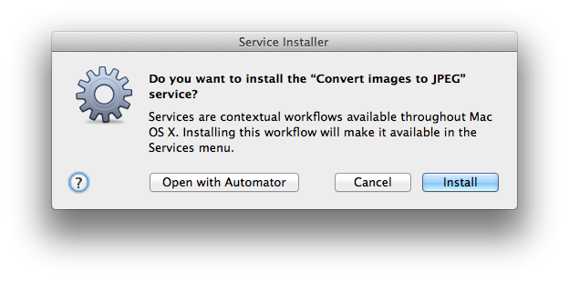

This page contains links to all resources mentioned in POV Break E of the
textbook.

# VirtualDub for Windows

This POV Break introduces the software VirtualDub for Windows, the download
links and installation instructions for which appear on [the Software
Packages page of this site](software-packages.md).

# Time Lapse Assembler for OS X

This POV Break introduces the software Time Lapse Assembler for Mac OS X,
the download links and installation instructions for which appear on [the
Software Packages page of this site](software-packages.md).

Alternately, if you already have QuickTime Pro (which is not free software)
you can use it instead of Time Lapse Assembler, according to [the directions
on this web
site](http://content.videoblocks.com/2011/09/how-to-create-an-time-lapse-video-in-quicktime-pro-7.html).

# Convert images to JPEG Service for OS X

If you use Time Lapse Assembler, still frames need to be in JPEG format.  To
quickly convert a set of images to that format, use the Mac OS X Service I
provide on this website; [download it
here](files/Convert%20images%20to%20JPEG.workflow.zip). Unzip it after
downloading and double-click the resulting .workflow file. OS X will show
you a prompt like the following one, asking if you want to install the
service on your computer.

You should choose Install, and thereafter you should find the service on the
Services menu in Finder, when you have a set of image files selected.  See
POV Break E in the textbook for more information.

# 13 Example Animation Types Video

This video showcases the 13 animation types covered in the text.  Although
the text includes still frames taken from some of these example animation
types, the video obviously is a better representation, since it is animated,
and it includes all 13 types rather than just a selection.

<iframe width="560" height="315" src="https://www.youtube.com/embed/ebmzrEixIs0" frameborder="0" allowfullscreen></iframe>

# Friedrich Lohmüeller's Camera Animation Video

[View the video on Lohmüeller's own site](http://www.f-lohmueller.de/pov_anim/ani_5002d.htm).

# Project information for Instructors

Because this project works best if you use it as preparation for the movie
project, I suggest that my students begin by choosing one or more objects
that they plan to include in their movie project, and animating those same
objects in this project also. They may need to create such objects if they
don't already have access to them. This project is designed to be work they
would mostly have to do as part of [POV Break F](pov-break-f-resources.md)'s
project anyway. It can serve as a rough draft or initial concepts that will
form part of that later movie project. I do not _require _that this project
be connected to the movie project; students who are still uncertain about
what their movie project will be may do this project on its own and figure
that out later.

When my students do this project, I require them to post the results to a
wiki on our learning management system, Blackboard.  I grade it out of 100%
according to the following breakdown, which I share with students in
advance.  This project is easy and this breakdown is generous, which
encourages them to do the work of forming these essential skills in
preparation for the much harder project in [POV Break
F](pov-break-f-resources.md).

<table border="1" cellspacing="0" cellpadding="5">
  <tr>
    <td>
      Posting three AVI files
    </td>

    <td>
      10%
    </td>
  </tr>

  <tr>
    <td>
      Doing so before the deadline
    </td>

    <td>
      10%
    </td>
  </tr>

  <tr>
    <td>
      Ensuring the first AVI file is a valid, web-viewable POV movie
    </td>

    <td>
      10%
    </td>
  </tr>

  <tr>
    <td>
      Ensuring the second AVI file is a valid, web-viewable POV movie
    </td>

    <td>
      10%
    </td>
  </tr>

  <tr>
    <td>
      Ensuring the third AVI file is a valid, web-viewable POV movie
    </td>

    <td>
      10%
    </td>
  </tr>

  <tr>
    <td>
      Having created at least one new object or piece of scenery
    </td>

    <td>
      10%
    </td>
  </tr>

  <tr>
    <td>
      Ensuring that your first AVI file is one of the types of animation listed in POV Break E
    </td>

    <td>
      10%
    </td>
  </tr>

  <tr>
    <td>
      Ensuring that your second AVI file is a different type of animation than the first
    </td>

    <td>
      10%
    </td>
  </tr>

  <tr>
    <td>
      Ensuring that your third AVI file is a different type of animation than the first two
    </td>

    <td>
      10%
    </td>
  </tr>

  <tr>
    <td>
      Doing something unique, creative, cool, or impressive
    </td>

    <td>
      10%
    </td>
  </tr>
</table>
