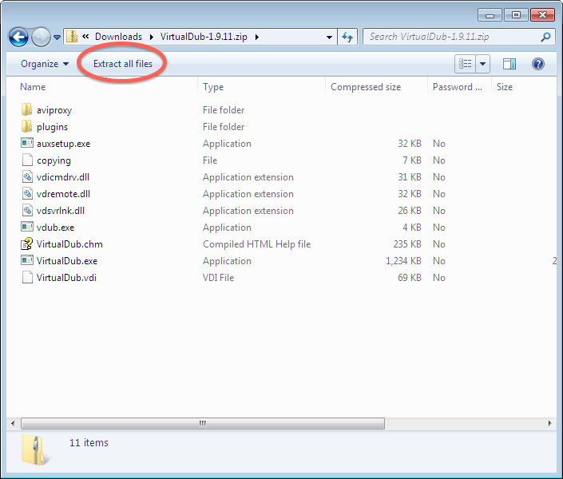

# POV-Ray

The Persistence of Vision Raytracer can be obtained from [its website](http://www.povray.org/).  Or you can click [this direct link to the installer for Microsoft Windows](http://www.povray.org/redirect/www.povray.org/ftp/pub/povray/Official/povwin-3.7-agpl3-setup.exe), on the download page from that same site.

Instructions for installing and using the software are provided in the textbook itself.

The textbook recommends that Mac users install the Windows version in a
virtual machine, or using Wine.  But if you prefer a native user interface,
even if it doesn't match the texbook's content, see [the Unofficial POV-Ray
GUI for Mac](http://megapov.inetart.net/povrayunofficial_mac/finalpov.html).
Mac users may find it easier to get started with a copy of [the Basic Scene
01](files/basic-scene-01.pov) from the Windows version of POV-Ray.

# VirtualDub for Windows

This software package creates videos from sequences of still frames created
in POV-Ray.  You can visit [its website](http://virtualdub.org/), or go
directly to [downloading a version for your Windows
computer](https://sourceforge.net/projects/virtualdub/files/virtualdub-win/1.9.11.32842/VirtualDub-1.9.11.zip/download).
Instructions for installing the software appear below; instructions for
using it are provided in the textbook itself.

  1. Download the software using one of the links above.
  2. Open the file you download, which is a `.zip` archive.
  3. In the window that opens, click the button labeled "Extract all
     files," as shown in the screenshot below.
  4. Choose any folder on your hard drive where you wish to keep this
     program.  One sensible place is to put it is in the same folder on
     your hard drive where you keep all your POV files.

You do not need to download or install the software more than once; this is
a one-time-only procedure. To run the program (now or at any future time)
use Windows Explorer to navigate to the folder you chose and double-click
the file <tt>VirtualDub.exe</tt>.  To make a shortcut for VirtualDub on your
desktop, right-click the <tt>.exe</tt> file and choose "Copy," then
right-click on your desktop and choose to paste a shortcut.

# Time Lapse Assembler for Mac OS X

Download and install this application as follows.

  1. First download the application from [the developer's
     website](http://www.dayofthenewdan.com/projects/time-lapse-assembler-1/).
     It downloads as a disk image (`.dmg`) file, which your system probably
     placed in your Downloads folder.
  2. Find that file and double-click it to mount and open it in Finder.
     This will show you the contents of the disk image, which is just the
     app itself and a link to your Applications folder, as shown in the
     screenshot below.
  3. Click and drag the application into your Applications folder.  This
     installs the app on your system.
  4. You can then close the disk image window, find the disk image on your
     desktop, and drag it to the Trash to unmount it.

You only need to follow this installation procedure once.  Now that the
software is installed on your computer, to launch it, simply navigate to
your Applications folder (which appears in the Dock, for many users) and
double-click Time Lapse Assembler.

Mac users will need to ensure that all frames of an animation are in JPEG
format.  To do so, see the Mac OS X Service I provide for that purpose,
which you can [download from the "first animations"
page](https://mocg.wordpress.com/pov-break-e-resources/).

# ffmpeg for Linux

Visit [the ffmpeg website](http://www.ffmpeg.org/) and follow the download
and installation instructions for binaries for your type of Linux
distribution.
